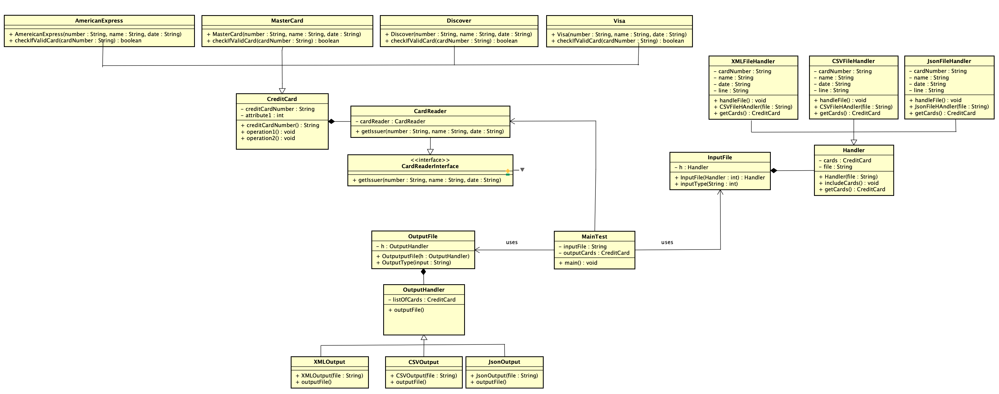

# individual-project-prideven
individual-project-prideven created by GitHub Classroom

# CMPE 202-Credit Card Problem

Priyanka Devendran	015231411

## Primary problem I’m trying to solve:

To find out the card type for the different input cards present in the file.

## How I solved the problem:

By implementing Factory Method design pattern.

**Factory design pattern helps in the following:**
-	Helps in creating the object without exposing the creational logic to the client.
- It also provides abstraction between the implementation and client classes through inheritance.
-	The object is created depending on the input value.

**Consequence of using Factory Method:**
-	Helps in reducing application specific classes in our code.
-	Makes the classes easily to extend or enhance if needed. 

## Secondary problem I’m trying to solve:

To create an object for the different types of input passed, here we are handling (xml, csv and json files) 

## How I solved the problem:

By using Strategy Design Pattern used:

**Startegy Pattern1:**

**Strategy Pattern2:**

Strategy design pattern helps in the following:
-	It makes the code future oriented that is it can be extended if any other type of input files are sent without the context entity.
-	Supports different types on input files.

**Consequence of using the pattern:**
-	Class type to be executed is decided dynamically during run time depending on the file type.
-	Classes are loosely coupled ,allowing to extend the classes further if any more file type needs to be handled in future. 

## Overall Class Diagram:

## Steps To Run and Test files:

- Clone the repsoitory.
- Import the gson and json jar files to the project library.
- Build the java files and obtain the class files.
- Naviagte to Project1 folder and Run the MainTest class file as given below.

- In order to run the Application using the CSV File, the command to run the main class is:
   java card.MainTest inputfile outputfile
   
- To run the Application using the XML File, the command to run the main class is:
  java card.MainTest inputfile outputfile
  
- To run the Application using the JSON File, the command to run the main class is:
  java -cp .:/SourcePath/Project1/out/artifacts/Project1_jar/Project1.jar card.MainTest inputfile outputfile
  

## The Junit test for each classes can be found in the folder:
https://github.com/gopinathsjsu/individual-project-prideven/tree/master/Test/card

